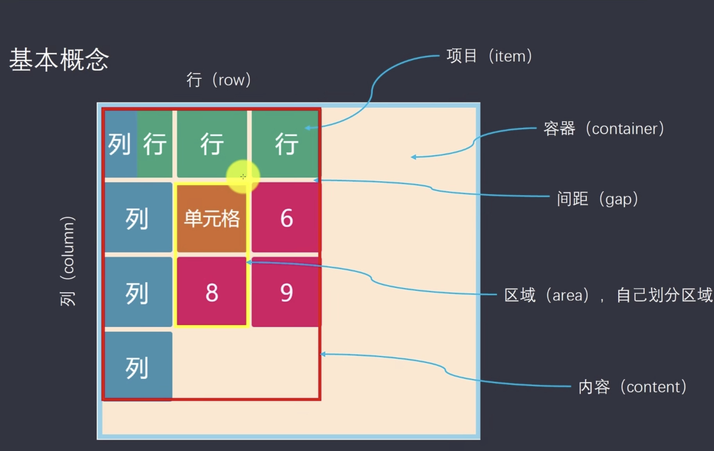

## Flex 布局

`Flex` 是 `Flexible Box` 的缩写，意为`弹性布局`。`任何一个容器`都可以指定为 `flex` 布局。

当父容器设为 `flex` 布局之后，子元素的 `float`、`clear` 和 `vertical-align` 属性将失效。

### Flex 布局`父项`常用属性

1. **flex-direction** 设置主轴方向

|         属性值 | 说明            |
| -------------: | :-------------- |
|            row | 默认值 从左到右 |
|    row-reverse | 从右到左        |
|         column | 从上到下        |
| column-reverse | 从下到上        |

2. **justify-content** 设置主轴上的子元素排列方式

| 属性值        | 说明                                           |
| ------------- | ---------------------------------------------- |
| flex-start    | 默认值 从头部开始，如果主轴是 x 轴，则从左到右 |
| flex-end      | 从尾部开始排列                                 |
| center        | 在主轴居中对齐（如果主轴是 x 轴，则水平居中）  |
| space-around  | 平分剩余空间                                   |
| space-between | 先两边贴边，再平分剩余空间                     |
| space-evenly  | 所有子元素两边的剩余空间都保持一样             |

3. **flex-wrap** 设置子元素是否换行

| 属性值 | 说明           |
| ------ | -------------- |
| nowrap | 默认值，不换行 |
| wrap   | 换行           |

4. **align-content** 设置侧轴上的子元素的排列方式（**多行**）

| 属性值        | 说明                                   |
| ------------- | -------------------------------------- |
| flex-start    | 默认值，在侧轴的头部开始排列           |
| flex-end      | 在侧轴的尾部开始排列                   |
| center        | 在侧轴中间显示                         |
| space-around  | 子项在侧轴平分剩余空间                 |
| space-between | 子项在侧轴先分布在两头，再平分剩余空间 |
| stretch       | 设置子项元素高度平分父元素的高度       |

5. **align-items** 设置侧轴上的子元素的排列方式（**单行**）

| 属性值     | 说明                     |
| ---------- | ------------------------ |
| flex-start | 默认值，从上到下         |
| flex-end   | 从下到上                 |
| center     | 挤在一起居中（垂直居中） |
| stretch    | 拉伸                     |

6. **flex-flow** 复合属性，相当于同时设置了 `flex-direction` 和 `flex-wrap`

### Flex 布局`子项`常用属性

1. `flex` 子项点的份数
2. `align-self` 控制子项自己在侧轴的排列方式
3. `order` 定义子项的排列顺序

## Grid 布局

`Grid` 布局将容器划分成“行”和“列”，产生单元格，可以看作是“二维布局”。



### 容器 Container

## Container 上的常用属性

1. **grid-template-columns** 用来设置 Grid 的列数
   **grid-template-rows** 用来设置 Grid 的行数

   ```css
   .container {
     <!-- 表示创建grid为3列，每列的宽度为100px -->
     grid-template-columns: 100px 100px 100px;
     <!-- 与上面的效果是一样的 -->
     <!-- repeat的第1个参数表示要重复多少次，第2个参数表示要重复的值 -->
     grid-template-columns: repeat(3, 100px);

     <!-- 单元格大小是固定的100px，auto-full表示会根据父容器的大小再进行自动填充，即列数不定 -->
     grid-template-columns: repeat(auto-fill, 100px);

     <!-- fr(fraction)表示比例关系 -->
     <!-- 1fr 2fr 3fr 表示将容器的宽度等分成6分，第1列占一份，第2列占二份，第3列占三份 -->
     grid-template-columns: 1fr 2fr 3fr;

     <!-- 3列，并等分宽度 -->
     grid-template-columns: repeat(3, 1fr);

     <!-- minmax(最小值，最大值 ) -->
     grid-template-columns: 1fr minmax(150px, 1fr);

     <!-- auto表示由浏览器决定大小 -->
     <!-- 此处因为两边都为1fr，此时中间的大小就只会包含其内容的大小，两边会平分宽度 -->
     grid-template-columns: 1fr auto 1fr;
     <!-- 此处因为两边都为固定宽度，此时中间的大小即为容器剩余的所有宽度 -->
     grid-template-columns: 100px auto 100px;

     <!-- c1-c4, r1-r5表示grid中行、列的边框线的引用 -->
     grid-template-columns: [c1] 100px [c2] 100px [c3] 100px [c4];
     grid-template-rows: [r1] 100px [r2] 100px [r3] 100px [r4] 100px [r5];
   }
   ```

2. `row-gap` \ `column-gap` \ `gap` 行、列之间的间隙

   ```css
   .container {
     <!-- 行间距为10px  -->
     row-gap: 10px;

     <!-- 列间距为10px  -->
     column-gap: 10px;

     <!-- 行、列间距都为10px  -->
     gap: 10px;

    <!-- 行间距为40px，列间距为20px -->
     gap: 40px 20px;
   }
   ```

3. `grid-auto-flow` 子元素的排放顺序

   ```css
   <!-- 默认的子元素排放顺序，先行后列 -->
   grid-auto-flow: row;

    <!-- 子元素 先列后行 进行排放 -->
   grid-auto-flow: column;
   ```

4. `justify-items` 设置子元素 **水平方向** 上的对齐方式
   `align-items` 设置子元素 **垂直方向** 上的对齐方式
   `place-items` 上面两者的组合表示方式

   ```css
   justify-items: start | end | center | stretch;
   align-items: start | end | center | stretch;

   place-items: <align-items> <justify-items>;
   ```

5. `justify-content`、`align-content` 设置**整个内容区域**在 `Grid` 中的水平和垂直方向上的对齐方式

   ```css
   justify-content: start | end | center | stretch | space-around |
     space-between | space-evenly;

   align-content: start | end | center | stretch | space-around | space-between
     | space-evenly;
   ```

6. `grid-auto-columns`、`grid-auto-rows` 用来设置多出来的项目的 宽和高

```css
grid-auto-columns: 50px;

grid-auto-rows: 40px;
```

### 项目

Items 上的常用属性：

1. `justify-self` 设置单元格内容的 水平位置
   `align-self` 设置单元格内容的 垂直位置
   `place-self` 二者的简写

   ```css
   justify-self: start | end | center | stretch;
   align-self: start | end | center | stretch;
   place-self: <align-self> <justify-self>;
   ```

---

CSS 包含 3 种基本的布局模型：

## 流动模型 Flow , HTML 网页的默认布局模式

特征：

- 块状元素都会在所处的包含元素内 **自上而下** 按顺序垂直延伸分布，因为在默认状态下，块状元素的宽度都为 100%。实际上，块状元素都会以行的形式占据位置。
- 内联元素都会在所处的包含元素内 **从左到右** 水平分布显示。

## 浮动模型 Float

    > 当设置了 float 属性后，会影响紧邻其后的元素，也只会影响紧邻其后的元素。
    > 清除浮动的常用方法(在受到影响的元素上)：
        1. 为元素设置**clear**属性，如clear:both;  clear:left;   clear:right。  clear 一般只设置在紧邻元素上起效果。
        2. 同时为元素设置width:100%（或固定宽度） + overflow:hidden;**overflow:hidden;width:100%;**：

## 层模型 Layer

层模型有三种形式：

1. 绝对定位(position:absolute), 相对于其最接近的一个具有定位属性的父包含块进行绝对定位。如果不存在这样的包含块，则相对于 body 元素，即相对于浏览器窗口。

2. 相对定位(position:relative) ,相对定位完成的过程是首先按 static(float)方式生成一个元素(并且元素像层一样浮动了起来)，然后相对于以前的位置移动，移动的方向和幅度由 left、right、top、bottom 属性确定，偏移前的位置保留不动。

3. 固定定位(position:fixed),视图本身是固定的，它不会随浏览器窗口的滚动条滚动而变化，除非你在屏幕中移动浏览器窗口的屏幕位置，或改变浏览器窗口的显示大小，因此固定定位的元素会始终位于浏览器窗口内视图的某个位置，不会受文档流动影响，这与 background-attachment:fixed;属性功能相同。
   静态定位(static)
   相对定位(relative)
   相对于自身原有位置进行偏移*
   仍处于标准文档流中*
   随即拥有偏移属性和 z-index 属性\_
   - 绝对定位(absolute,fixed) \*建立了以包含块为基准的定位\*
     _完全脱离了标准文档流_
     _随即拥有偏移属性和 z-index 属性_
     当一个元素设置了绝对定位，没有设置宽度时，元素的宽度根据内容进行调节。 1. 当设置的元素没有 设置定位或偏移量的祖先元素时，在对其设置偏移后，其是 html 标签元素进行偏移的，而不是 body 元素。 2. 当设置的元素有 已经设置定位或者偏移的祖先元素时，在对其设置偏移后，其是针对祖先元素进行偏移。

## Relative 与 Absolute 组合使用

一个元素相对于其它元素进行定位，必须遵守如下规范：

1. 参照定位的元素必须是相对定位元素的前辈元素：

```html
<div id="box1”>
  <!--参照定位的元素-->
  <div id="box2">相对参照元素进行定位</div>
  <!--相对定位元素-->
</div>
```

2. 参照定位的元素必须加入**_ position:relative_**

```css
#box1 {
  width: 200px;
  height: 200px;
  position: relative;
}
```

3. 定位元素加入**_position:absolute_**,便可以使用 top,bottom,left,right 来进行偏移定位了。

```css
#box2 {
  position: absolute;
  top: 20px;
  left: 30px;
}
```

这样 box2 就可以相对于父元素 box1 定位了。

# 样式

1. border-style(边框样式)常见样式有：`dashed(虚线) | dotted(点线) | solid(实线)`
2. **_em_** 如果元素的 font-size 为 14px,那么 1em = 14px;如果 font-size=18px,那么 1em=18px。 当给 font-size 设置单位为 em 时，此时计算的标准以父元素的 font-size 为基础。

```html
<p>以这个<span>例子</span>为例。</p>
```

`css p{font-size:14px} span{font-size:0.8em;}`
结果 span 中的字体“例子”字体大小就为 11.2px （14\*0.8=11.2） 3.
块状元素使用`text-align:center`不起作用，在满足**_
定宽_**的条件下，可以通过`margin:0 auto`来实现居中。

4. 不定宽度的块状元素有三种方法居中：

   1. 加入 table 标签
   2. 设置块级元素的`display:inline`，然后使用`text-align:center`来实现居中：

   ```html
   <body>
     <div class="container">
       <ul>
         <li><a href="#">1</a></li>
         <li><a href="#">2</a></li>
         <li><a href="#">3</a></li>
       </ul>
     </div>
   </body>
   ```

   ```css
   <style>
     .container {
       text-align: center;
     }
     .container ul {
       list-style: none;
       margin: 0;
       padding: 0;
       display: inline;
     }
     .container li {
       margin-right: 8px;
       display: inline;
     }
   </style>
   ```

   3. 设置`position:relative` 和

`left:50%`,通过给父元素设置_float_,然后给父元素设置`position:relative
`和`left:50%`,子元素设置`position:relative`和`left:-50%`来实现水平居中。 5.
垂直居中— 父元素高度确定的单行文本 ， 通过设置父元素的_height_和 _line-height_
高度一致来实现。

```html
<div class="wrap">
  <h2>hi,imooc!</h2>
</div>
```

```css
<style>
.container{
    height:100px;
    line-height:100px;
    background:#999;
}
</style>
```

6. 垂直居中-父元素高度确定的多行文本（方法一）
   使用插入 table (包括 tbody、tr、td)标签，同时设置 vertical-align：middle。
   说到竖直居中，css 中有一个用于竖直居中的属性 vertical-align，但这个样式只有在父元素为 td 或 th 时，才会生效。
   html code:

```html
<body>
  <table>
    <tbody>
      <tr>
        <td class="wrap">
          <div>
            <p>看我是否可以居中。</p>
            <p>看我是否可以居中。</p>
            <p>看我是否可以居中。</p>
            <p>看我是否可以居中。</p>
            <p>看我是否可以居中。</p>
          </div>
        </td>
      </tr>
    </tbody>
  </table>
</body>
```

css code:

```css
table td {
  height: 500px;
  background: #ccc;
}
```

7. 垂直居中-父元素高度确定的多行文本（方法二）
   > 在 chrome、firefox 及 IE8 以上的浏览器下可以设置块级元素的 display 为 table-cell，激活 vertical-align 属性，但注意 IE6、7 并不支持这个样式。
   > html code:

```html
<div class="container">
  <div>
    <p>看我是否可以居中。</p>
    <p>看我是否可以居中。</p>
    <p>看我是否可以居中。</p>
    <p>看我是否可以居中。</p>
    <p>看我是否可以居中。</p>
  </div>
</div>
```

css code:

```css
<style>
.container{
    height:300px;
    background:#ccc;
    display:table-cell;/*IE8以上及Chrome、Firefox*/
    vertical-align:middle;/*IE8以上及Chrome、Firefox*/
}
</style>
```

8. 隐性改变 display 类型
    > 当为元素（不论之前是什么类型元素，display:none 除外）设置以下 2 个句之一：
        1. position : absolute
        2. float : left 或 float:right
    元素会自动变为以 display:inline-block 的方式显示，当然就可以设置元素的 width 和 height 了且默认宽度不占满父元素。
    > 如，a 标签是行内元素，所以设置它的 width 是 没有效果的，但是设置为 position:absolute 以后，就可以了：
    > html code:

```html
<div class="container">
  <a href="#" title="">进入课程请单击这里</a>
</div>
```

css code:

```css
<style>
.container a{
    position:absolute;
    width:200px;
    background:#ccc;
}
</style>
```
