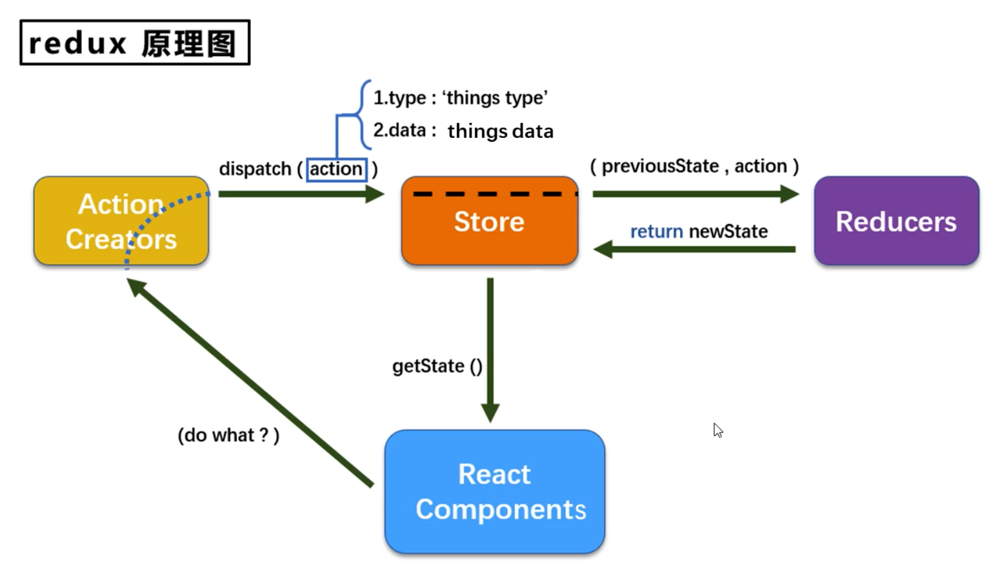

## Redux & React-Redux

`Redux` 就 `Javascript` 应用的状态容器，提供可预测的状态管理。

`Redux` 的核心概念是 `store，它是一个包含应用程序状态的对象。`

`Redux` 的工作原理是通过分派操作来更新 `store` 中的状态。操作是一个描述如何更新状态的对象。当您分派一个操作时，`Redux` 将调用 `reducer` 函数来更新 `store` `中的状态。reducer` 函数接受当前状态和操作作为参数，并返回一个新状态。这个新状态将成为 `store` 中的新状态。

`React-Redux` 主要用来集中管理 `react` 应用中多个组件 **共享** 的状态。



### Redux 的三个核心概念

#### Action

Action 动作对象，它包含 2 个属性：

- `type`: 标识属性，值为字符串，且必须为唯一，必要属性。
- `data`: 数据属性，值类型任意，可选属性。

#### Store

将 state、action、reducer 联系在一起的对象。

#### Reducer

用于初始化状态和加工状态值。
加工时，根据旧的 `state` 和 `action`， 产生新的 `state` 的 **纯函数**。

## 使用的一般步骤

1. 创建全局公共的容器，用来存储各组件需要的公共信息（公共状态和事件）：

   ```jsx {.line-numbers}
   const store = createStore([reducer]);
   ```

2. 在组件内部，获取公用状态信息，然后进行渲染。

   ```jsx {.line-numbers}
   store.getState();
   ```

3. 把“让组件可以更新”的方法放在公共容器的事件池中。

   ```jsx {.line-numbers}
   store.subscribe(函数);
   ```

4. 创建容器的时候，需要传递 reducer

   ```jsx {.line-numbers}
   let initial = {...}; //初始状态值
   const reducer = (state=initial, action) =>{
     // action 派发的行为对象（必须具备type属性）
     // state 容器中的状态
     switch(action.type){
       //根据传递的type值，修改对应的状态信息
     }
     // 返回的信息会替换store容器中的公共状态
     return state;
   }
   ```

5. 派发任务，通过 reducer 执行修改状态

   ```jsx {.line-numbers}
   store.dispatch({
     type: xxx,
     ...
   })
   ```

## Redux Toolkit

Redux Toolkit

## Redux DevTools 拓展
